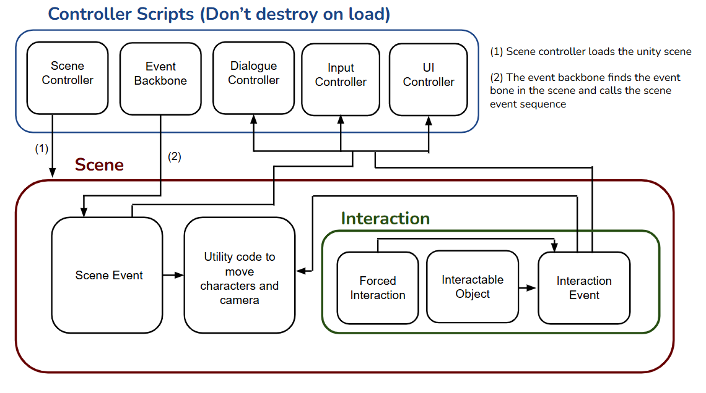

## Project Structure
Check the **Blender Files** folder in the root directory for Blender models used in the game. The FBX files for the models that are actually used in the project are located in `Assets -> Prefabs -> Models`.

In the **Assets** folder, you can find the following:

- **Dialogue**: Contains dialogue data stored as scriptable objects.
- **Downloaded Textures**: Texture images from free Unity asset packages.
- **Images**: Contains image files to be used in the game.
- **Prefab**: Contains 3D model data for characters and environments, as well as animation data.
- **Scenes**: Contains the Unity scene files for the game.
- **Scripts**: Contains all scripts used in the Unity scenes.
- **Visual Effects**: Contains all shader code and materials used in the Unity scenes.

## Code Structure

The project currently uses **5 controller scripts** that are persistent through all scenes. They are added to the game in an initialization scene and have a "Don't Destroy on Load" script attached. The controller scripts control:

- **Scene**: Manages scene transitions and loading.
- **Events**: Manages game events.
- **Dialogue**: Manages dialogue systems.
- **UI**: Controls the user interface.
- **Input**: Handles user input.

When a game scene is loaded via the **Scene Controller**, the **Event Backbone** finds the event bone object in the scene and calls on the scene event script attached to it in order to execute the scene sequence. This scene sequence can include:

- **Cutscenes**: Formulated by utility scripts to move characters or the camera.
- **Dialogue**: Integrated into the scene flow.

At points in the scene sequence where user input is possible, it may trigger interaction events, which can also include cutscenes or dialogue.

### Scene Events and Interaction Events

Both **Scene Events** and **Interaction Events** are abstract classes. They can be inherited by future additions to the game.
